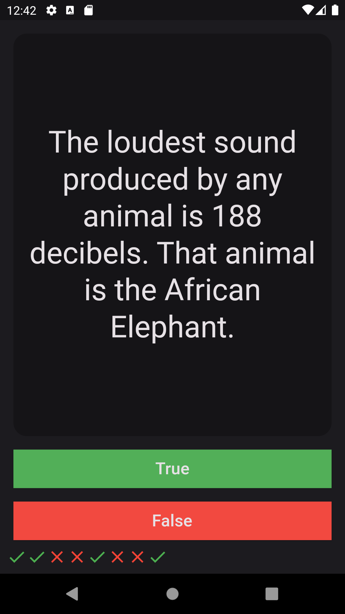
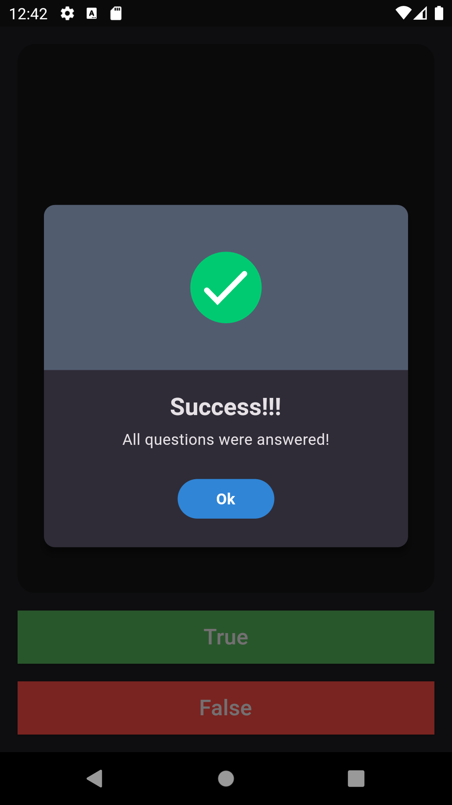

# **quiztime**

This is a beginner - mid level new Flutter project.

## **About This App**

This is a demonstration of quiz application.

There are a lot of questions.

Answers are either true or false.

After you answered a question, result of question will be appear on bottom of the screen.

When you finished the questions, there will a pop op show up.

It will tell you finished all questions and it will restart quiz.

👍

## **Sample Pictures**

---

